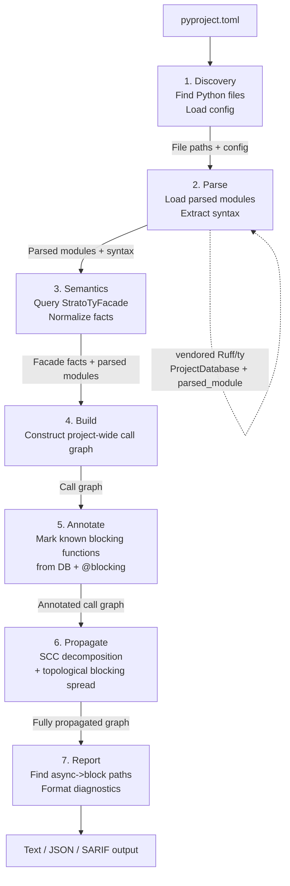

# Architecture Overview

### System Diagram



### Component Map

```
strato-cli (Rust binary)
├── strato_core          # Core analysis library
│   ├── discovery        # File finder, config loader
│   ├── parser           # Extracts syntax from Ruff parsed modules
│   ├── semantics        # Strato facade over vendored Ruff/ty semantic APIs
│   ├── graph            # Call graph data structures
│   ├── annotator        # Blocking function database + decorator detection
│   ├── propagator       # SCC-based blocking propagation
│   └── reporter         # Diagnostic generation + formatting
├── strato_ty_adapter    # Narrow compatibility layer over vendored Ruff/ty
├── strato_cache         # Incremental caching system
└── strato_cli           # CLI entry point, arg parsing, output formatting

vendor/ruff              # Pinned Ruff monorepo submodule with Strato patches
└── crates/
    ├── ruff_db
    ├── ruff_python_ast
    ├── ruff_python_parser
    ├── ty_project
    ├── ty_module_resolver
    ├── ty_python_core
    └── ty_python_semantic

strato (Python package)
└── strato/
    ├── __init__.py      # Re-exports decorators
    ├── _annotations.py  # @blocking, @non_blocking, @unblocker definitions
    └── py.typed         # PEP 561 marker
```

### Key Data Structures

| Structure | Purpose | Defined In |
|-----------|---------|------------|
| `StratoTyProject` | Owns the vendored Ruff/ty `ProjectDatabase` and exposes parsed modules, files, and semantic queries | [Phase 3: Semantics](./analysis-pipeline.md#phase-3-semantics-strato-ty-facade) |
| `StratoTyFacade` | Small Strato-owned API over patched vendored Ruff/ty helpers for call, attribute, property, and dunder target resolution | [Phase 3: Semantics](./analysis-pipeline.md#phase-3-semantics-strato-ty-facade) |
| `ResolvedTarget` | Normalized semantic target: first-party definition, external qualified aliases, or unknown | [Phase 3: Semantics](./analysis-pipeline.md#phase-3-semantics-strato-ty-facade) |
| `CallGraph` | Directed graph of function call relationships | [Graph Data Model](./call-graph-type-resolution.md#graph-data-model) |
| `BlockingDatabase` | Registry of known blocking functions | [Database Structure](./blocking-function-database-annotations.md#database-structure) |
| `EscapeHatchRegistry` | Patterns recognized as safe executor wrapping | [Generalized Wrapper Registry](./escape-hatches-executor-wrappers.md#generalized-wrapper-registry) |
| `Diagnostic` | Reported issue with location, chain, and help text | [Error Codes](./error-reporting-diagnostics.md#error-codes) |
| `AnalysisCache` | Serialized per-file results for incremental analysis | [Caching Strategy](./supporting-systems.md#caching-strategy) |

### Public API Contract (`strato_core`)

```rust
/// Top-level entry point: run the full analysis pipeline (Phases 1 – 7).
pub fn analyze(project_path: &Path, config: &Config) -> Result<AnalysisResult, AnalysisError>;

/// Configuration loaded from pyproject.toml [tool.strato] or defaults.
pub struct Config {
    pub src_roots: Vec<PathBuf>,            // Default: auto-detected
    pub python_version: PythonVersion,       // Default: "3.9"; valid 3.7 through 3.15
    pub intervention_strategy: InterventionStrategy, // Default: FirstPartyDeepest
    pub severity: Severity,                  // Default: Error
    pub exclude: Vec<String>,                // Default: []
    pub stub_paths: Vec<PathBuf>,            // Default: []; mapped to ty environment.extra-paths
    pub cache_dir: PathBuf,                  // Default: ".strato_cache"
    pub cache_enabled: bool,                 // Default: true
    pub blocking_config: BlockingConfig,     // Default: built-in database only
    pub escape_hatch_config: EscapeHatchConfig, // Default: built-in patterns only
}

/// Result of a complete analysis run.
pub struct AnalysisResult {
    pub diagnostics: Vec<Diagnostic>,    // Sorted per deterministic output rules
    pub warnings: Vec<AnalysisWarning>,  // Recoverable per-file/config-boundary warnings
    pub stats: AnalysisStats,
}

/// Analysis statistics for --stats output.
pub struct AnalysisStats {
    pub files_analyzed: usize,
    pub functions_analyzed: usize,
    pub call_graph_nodes: usize,
    pub call_graph_edges: usize,
    pub blocking_functions_found: usize,
    pub analysis_time_ms: u64,
    pub cache_hits: usize,
    pub cache_misses: usize,
}

/// Errors that can occur during analysis.
pub enum AnalysisError {
    ConfigError(ConfigError),   // Exit code 2
    IoError(std::io::Error),
    NoAnalyzableSourceFiles,    // Exit code 3
}
```

`call_graph_edges` includes synthetic executor-wrapper edges marked `in_executor=true`; those edges are graph facts even though they do not propagate blocking. `blocking_functions_found` counts resolved blocking roots even when all paths to them are executor-protected.
