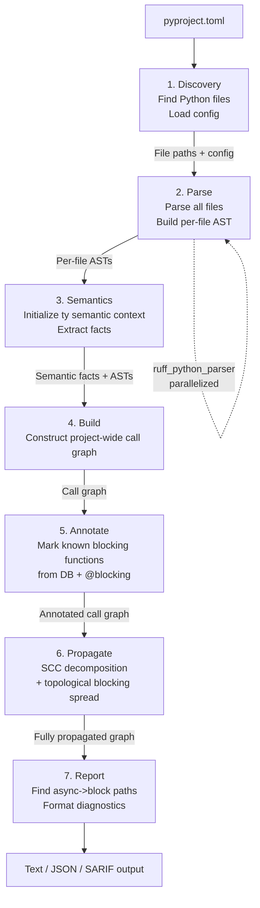

# Architecture Overview

### System Diagram



### Component Map

```
strato-cli (Rust binary)
├── strato_core          # Core analysis library
│   ├── discovery        # File finder, config loader
│   ├── parser           # Thin wrapper over ruff_python_parser
│   ├── semantics        # ty-backed module/name/type semantic layer
│   ├── graph            # Call graph data structures
│   ├── annotator        # Blocking function database + decorator detection
│   ├── propagator       # SCC-based blocking propagation
│   └── reporter         # Diagnostic generation + formatting
├── strato_cache         # Incremental caching system
└── strato_cli           # CLI entry point, arg parsing, output formatting

strato (Python package)
└── strato/
    ├── __init__.py      # Re-exports decorators
    ├── _annotations.py  # @blocking, @non_blocking, @unblocker definitions
    └── py.typed         # PEP 561 marker
```

### Key Data Structures

| Structure | Purpose | Defined In |
|-----------|---------|------------|
| `SemanticContext` | ty-backed project semantic state for module, name, and type facts | [Phase 3: Semantics](./analysis-pipeline.md#phase-3-semantics-ty-semantic-context) |
| `SemanticFactSet` | Stable facts Strato consumes from ty for graph construction | [Phase 3: Semantics](./analysis-pipeline.md#phase-3-semantics-ty-semantic-context) |
| `CallGraph` | Directed graph of function call relationships | [Graph Data Model](./call-graph-type-resolution.md#graph-data-model) |
| `BlockingDatabase` | Registry of known blocking functions | [Database Structure](./blocking-function-database-annotations.md#database-structure) |
| `EscapeHatchRegistry` | Patterns recognized as safe executor wrapping | [Generalized Wrapper Registry](./escape-hatches-executor-wrappers.md#generalized-wrapper-registry) |
| `Diagnostic` | Reported issue with location, chain, and help text | [Error Codes](./error-reporting-diagnostics.md#error-codes) |
| `AnalysisCache` | Serialized per-file results for incremental analysis | [Caching Strategy](./supporting-systems.md#caching-strategy) |

### Public API Contract (`strato_core`)

```rust
/// Top-level entry point: run the full analysis pipeline (Phases 1 – 7).
pub fn analyze(project_path: &Path, config: &Config) -> Result<AnalysisResult, AnalysisError>;

/// Configuration loaded from pyproject.toml [tool.strato] or defaults.
pub struct Config {
    pub src_roots: Vec<PathBuf>,            // Default: auto-detected
    pub python_version: PythonVersion,       // Default: "3.9"
    pub intervention_strategy: InterventionStrategy, // Default: FirstPartyDeepest
    pub severity: Severity,                  // Default: Error
    pub exclude: Vec<String>,                // Default: []
    pub stub_paths: Vec<PathBuf>,            // Default: []
    pub cache_dir: PathBuf,                  // Default: ".strato_cache"
    pub cache_enabled: bool,                 // Default: true
    pub blocking_config: BlockingConfig,     // Default: built-in database only
    pub escape_hatch_config: EscapeHatchConfig, // Default: built-in patterns only
}

/// Result of a complete analysis run.
pub struct AnalysisResult {
    pub diagnostics: Vec<Diagnostic>,    // Sorted per deterministic output rules
    pub stats: AnalysisStats,
}

/// Analysis statistics for --stats output.
pub struct AnalysisStats {
    pub files_analyzed: usize,
    pub functions_analyzed: usize,
    pub call_graph_nodes: usize,
    pub call_graph_edges: usize,
    pub blocking_functions_found: usize,
    pub analysis_time_ms: u64,
    pub cache_hits: usize,
    pub cache_misses: usize,
}

/// Errors that can occur during analysis.
pub enum AnalysisError {
    ConfigError(ConfigError),   // Exit code 2
    IoError(std::io::Error),
    AllParsesFailed,            // Exit code 3
}
```
